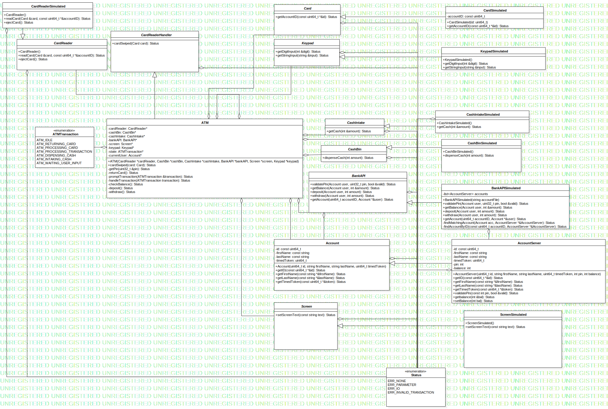

This folder contains the uml diagram I have designed for this problem.
A large goal with this structure is to allow the simulated parts to be swapped for the real part when it is ready to be deployed.

If any changes to the design are made I will update the file and the generated .svg

The mdj file is a StarUML file

#Diagram

